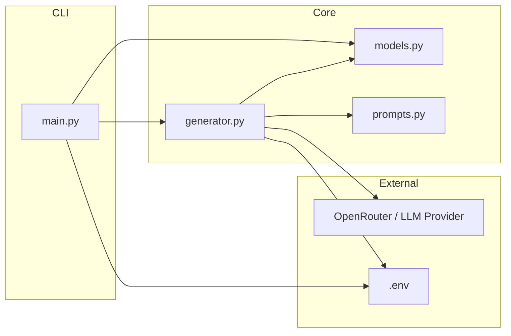
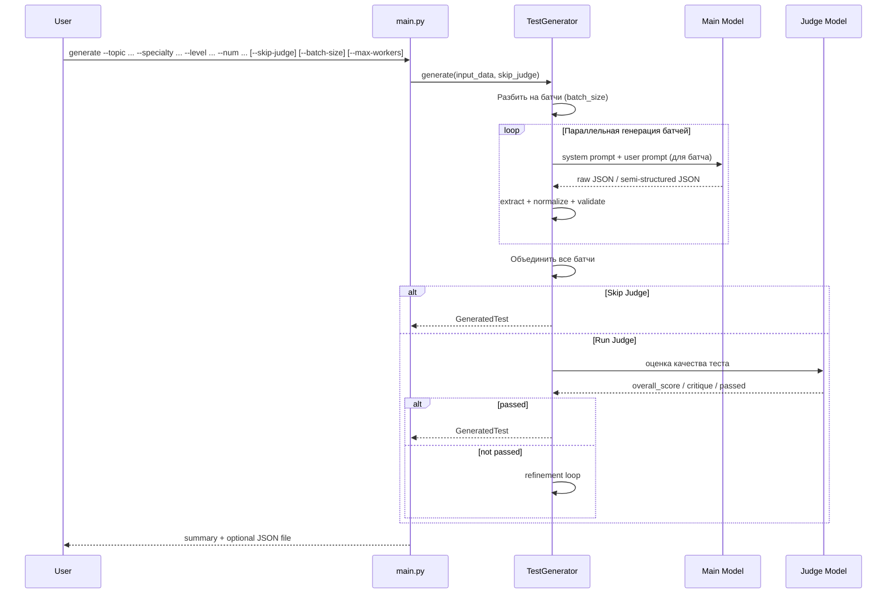
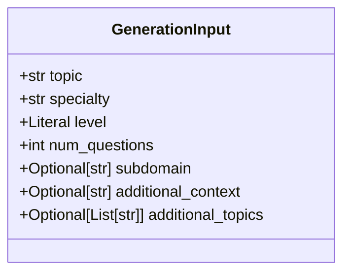
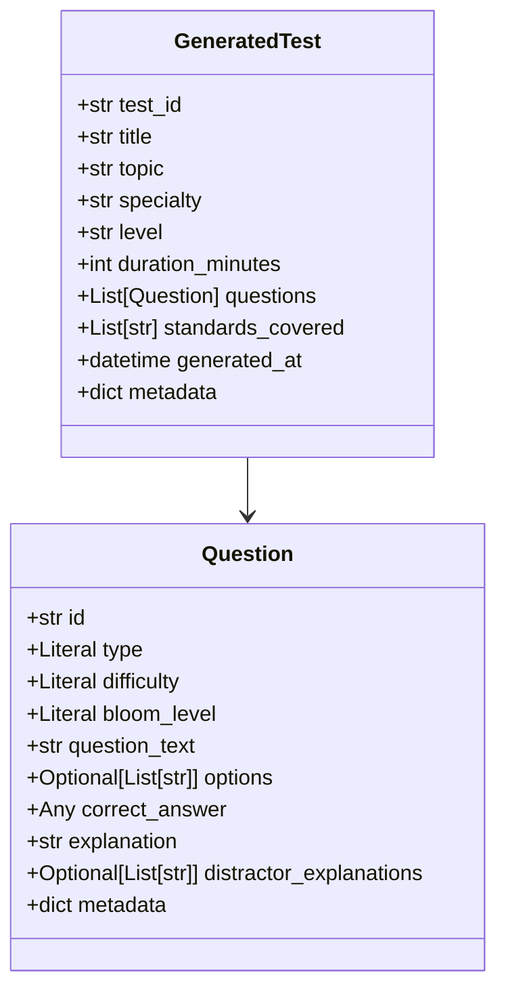
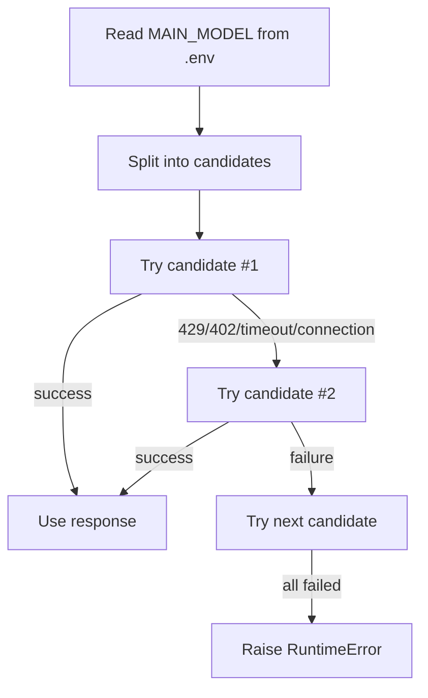

# LLM-core: Генератор Технических Тестов Для Нефтегазовой Отрасли

## О проекте

`LLM-core` — это CLI-приложение на Python для генерации структурированных технических тестов по hard skills в нефтегазовой отрасли с поддержкой параллельной батчевой генерации для ускорения.

Основная идея проекта:

- принять минимальный набор входных параметров;
- сгенерировать тест с помощью LLM (включая параллельную батчевую генерацию для больших тестов);
- привести ответ модели к внутренней схеме данных;
- прогнать результат через judge-модель (опционально);
- вернуть готовый JSON-файл, пригодный для дальнейшей интеграции.

Проект ориентирован на сценарии вроде:

- контроль скважины;
- бурение;
- HSE;
- process safety;
- добыча и промысловые операции;
- оценка инженеров уровня `Junior`, `Middle`, `Senior`, `Expert`.

---

## Что умеет проект

- **Параллельная батчевая генерация** — ускоряет создание больших тестов (до 50 вопросов).
- Генерация тестов по теме, специальности, уровню и количеству вопросов.
- Поддерживает **дополнительные темы**, которые должны присутствовать в тесте (без ограничения только ими).
- Поддерживает несколько типов вопросов:
  - `MCQ`
  - `Scenario`
  - `Calculation`
  - `Procedure`
- Проверяет структуру результата через Pydantic-модели.
- Выполняет пост-оценку качества через judge-модель (**опционально, можно пропустить для скорости**).
- Поддерживает fallback по нескольким моделям из `.env`.
- Умеет сохранять результат в JSON-файл.
- Содержит runtime-логирование для диагностики LLM-вызовов.

---

## Текущий статус

Это рабочая архитектура с CLI, генерацией, нормализацией ответа LLM, judge-оценкой, параллельной батчевой генерацией и конфигурацией через `.env`.

Что уже реализовано:

- CLI на `Typer` с расширенными параметрами
- схемы данных на `Pydantic`
- генерация через `LangChain + ChatOpenAI`
- совместимость с OpenRouter
- нормализация “грязного” JSON-ответа модели
- fallback по списку моделей
- retry/backoff для временных ошибок провайдера
- **параллельная батчевая генерация вопросов**
- **опциональный skip judge для скорости**
- **поддержка дополнительных тем для тестов**

Что пока отсутствует:

- полноценный RAG
- HTTP API
- веб-интерфейс
- unit/integration tests
- production-grade observability

---

## Архитектура

### Высокоуровневая схема

```mermaid
flowchart TD
    A[CLI: main.py] --> B[GenerationInput]
    B --> C[TestGenerator]
    C --> D[Prompt Builder]
    D --> E[LLM Main Generation (Parallel Batches)]
    E --> F[JSON Extraction]
    F --> G[Payload Normalization]
    G --> H[Pydantic Validation]
    H --> I{Skip Judge?}
    I -->|yes| J[GeneratedTest]
    I -->|no| K[Judge LLM]
    K --> L{passed?}
    L -->|yes| J
    L -->|no| M[Refinement Context]
    M --> D
    J --> N[Console Output]
    J --> O[JSON File]
```

### Архитектура компонентов



### Последовательность выполнения



---

## Структура проекта

```text
AI_test_genereation/
├── core/
│   ├── __init__.py
│   ├── generator.py
│   ├── models.py
│   └── prompts.py
├── docs/
│   ├── (Baseline) main system design.md
│   └── Development-plan.md
├── .env.example
├── main.py
├── requirements.txt
└── README.md
```

### Назначение файлов

- [main.py](file:///d:/Projects/AI_test_genereation/main.py) — CLI-вход в приложение с расширенными параметрами.
- [generator.py](file:///d:/Projects/AI_test_genereation/core/generator.py) — основная логика генерации, fallback, retry, нормализация, judge и **параллельная батчевая генерация**.
- [models.py](file:///d:/Projects/AI_test_genereation/core/models.py) — входные и выходные Pydantic-модели (с поддержкой `additional_topics`).
- [prompts.py](file:///d:/Projects/AI_test_genereation/core/prompts.py) — system/user/judge prompt templates.
- [`.env.example`](file:///d:/Projects/AI_test_genereation/.env.example) — пример конфигурации с параметрами батчей.
- [requirements.txt](file:///d:/Projects/AI_test_genereation/requirements.txt) — Python-зависимости.
- [(Baseline) main system design.md](file:///d:/Projects/AI_test_genereation/docs/%28Baseline%29%20main%20system%20design.md) — исходная архитектурная заметка.
- [Development-plan.md](file:///d:/Projects/AI_test_genereation/docs/Development-plan.md) — исходный план разработки MVP.

---

## Основной поток данных

### 1. Вход

CLI принимает:

- `topic` — основная тема теста
- `specialty` — специальность
- `level` — уровень (Junior/Middle/Senior/Expert)
- `num_questions` — количество вопросов (3-50)
- `--additional-topic/-at` — дополнительные темы (можно несколько раз)
- `--batch-size/-b` — количество вопросов в одном батче (по умолчанию 5)
- `--max-workers/-w` — количество параллельных потоков (по умолчанию 4)
- `--skip-judge` — пропустить оценку качества (ускоряет генерацию)
- `output` — путь к JSON-файлу

Эти значения превращаются в `GenerationInput`.

### 2. Формирование промпта

В [prompts.py](file:///d:/Projects/AI_test_genereation/core/prompts.py):

- `SYSTEM_PROMPT` задаёт роль senior petroleum engineer;
- `USER_PROMPT_TEMPLATE` подставляет тему, специальность, уровень, количество вопросов и дополнительные темы (если есть);
- `JUDGE_PROMPT_TEMPLATE` оценивает качество теста.

### 3. Батчевая генерация

В [generator.py](file:///d:/Projects/AI_test_genereation/core/generator.py):

- количество вопросов разбивается на батчи (по `batch_size`);
- каждый батч генерируется параллельно (до `max_workers` потоков);
- все результаты объединяются в один тест;
- для каждого батча работает логика fallback и retry.

### 4. Извлечение JSON

После ответа модели:

- извлекается текст ответа;
- убираются fenced code blocks;
- ищется JSON-объект;
- JSON парсится в `dict`.

### 5. Нормализация ответа

Поскольку LLM часто возвращает схему, не совпадающую 1-в-1 с внутренней моделью, проект делает нормализацию:

- `test_title` -> `title`
- `question` / `prompt` -> `question_text`
- `answer` -> `correct_answer`
- `standard_refs` -> `standards_covered`
- `options` как массив объектов -> `options` как массив строк
- `id` у вопросов приводится к строке
- отсутствующая `difficulty` восстанавливается из уровня

### 6. Валидация

Нормализованный payload валидируется через `GeneratedTest`.

### 7. Judge (опционально)

Если не указан `--skip-judge`:

- judge-модель получает нормализованный и валидный JSON;
- возвращает:
  - `overall_score`
  - `critique`
  - `passed`
- Если `passed == false`, генератор добавляет critique в контекст и запускает refinement loop.

### 8. Вывод

В `main.py`:

- печатается краткое summary;
- показываются первые 2 вопроса;
- выводится время генерации и общее время;
- при `--output` результат сохраняется в JSON-файл.

---

## Схема данных

### Входная модель `GenerationInput`



### Выходная модель `GeneratedTest`



---

## Конфигурация

Проект полностью конфигурируется через `.env`.

Пример из `.env.example`:

```env
OPENAI_API_BASE="https://openrouter.ai"
OPENAI_API_KEY="your api key"
OPENAI_TIMEOUT_SECONDS="60"

MAIN_MODEL="qwen/qwen3.5-flash-02-23,google/gemma-4-26b-a4b-it:free,nvidia/nemotron-3.5-34b-a3b:free"
JUDGE_MODEL="qwen/qwen3.5-flash-02-23,google/gemma-4-26b-a4b-it:free"

BATCH_SIZE="5"
MAX_WORKERS="4"
```

### Значение переменных

- `OPENAI_API_BASE` — базовый URL провайдера.
- `OPENAI_API_KEY` — API key.
- `OPENAI_TIMEOUT_SECONDS` — timeout одного вызова модели (увеличен до 60 секунд по умолчанию).
- `MAIN_MODEL` — одна модель или список моделей через запятую для генерации.
- `JUDGE_MODEL` — модель или список моделей для judge.
- `BATCH_SIZE` — количество вопросов в одном батче (по умолчанию 5).
- `MAX_WORKERS` — количество параллельных потоков для генерации (по умолчанию 4).

### Важный нюанс

Если используется OpenRouter и в `.env` указан `https://openrouter.ai`, проект сам нормализует адрес до `https://openrouter.ai/api/v1`.

---

## Стратегия отказоустойчивости

### Fallback по моделям



### Обработка ошибок

Проект отдельно различает:

- ошибки парсинга JSON;
- ошибки валидации Pydantic;
- ошибки провайдера (`402`, `429`, `timeout`, connection error);
- ошибки judge-модели.

Для judge сейчас предусмотрен fallback:

- если judge не отработал, возвращается безопасный результат по умолчанию;
- генерация теста при этом не блокируется.

Для батчевой генерации:

- каждый батч обрабатывается независимо;
- если батч не удалось сгенерировать после всех retry, он пропускается;
- тест формируется из успешно сгенерированных батчей.

---

## Логирование и отладка

В текущем состоянии в [generator.py](file:///d:/Projects/AI_test_genereation/core/generator.py) присутствует debug-инструментирование.

Оно логирует:

- инициализацию клиентов;
- попытки вызова моделей (включая каждый батч);
- успешные ответы;
- ошибки провайдера;
- шаги парсинга и нормализации;
- judge flow.

Сопутствующие артефакты:

- директория `.dbg/` во время активной отладки

При ошибке парсинга JSON выводится полный ответ модели для отладки.

---

## Ограничения текущей версии

### 1. Зависимость от внешнего провайдера

Если OpenRouter возвращает:

- `429` — rate limit;
- `402` — недостаточно кредитов;

то проект корректно диагностирует проблему, но не может “починить” внешний лимит самостоятельно.

### 2. Нет полноценного RAG

Сейчас `context` в генераторе — это stub:

```python
context = "Нет дополнительного контекста."
```

Архитектурно место для RAG предусмотрено, но сам retrieval-пайплайн ещё не реализован.

### 3. Нет автоматических тестов

На данный момент проекту не хватает:

- unit tests для нормализации JSON;
- integration tests для CLI;
- contract tests для judge.

### 4. Judge fallback упрощён

Если judge падает, проект возвращает условный безопасный результат, чтобы не ломать основной pipeline.

---

## Установка

### 1. Создать окружение

```bash
python -m venv .venv
```

### 2. Активировать окружение

Windows PowerShell:

```powershell
.\.venv\Scripts\Activate.ps1
```

### 3. Установить зависимости

```bash
pip install -r requirements.txt
```

### 4. Создать `.env`

Скопируйте [`.env.example`](file:///d:/Projects/AI_test_genereation/.env.example) в `.env` и заполните значения.

---

## Запуск

### Базовый запуск

```bash
python main.py generate --topic "Контроль скважины" --specialty "Инженер по бурению" --level Senior --num 5
```

### Быстрая генерация (без judge)

```bash
python main.py generate --topic "Контроль скважины" --specialty "Инженер по бурению" --level Senior --num 5 --skip-judge
```

### Батчевая генерация большого теста (50 вопросов)

```bash
python main.py generate \
    --topic "Контроль скважины" \
    --specialty "Инженер по бурению" \
    --level Senior \
    --num 50 \
    --batch-size 10 \
    --max-workers 8 \
    --skip-judge \
    --output big_test.json
```

### С дополнительными темами

```bash
python main.py generate \
    --topic "Контроль скважины" \
    --specialty "Инженер по бурению" \
    --level Senior \
    --num 20 \
    --additional-topic "Буровые растворы" \
    --additional-topic "Нормы КИП" \
    --skip-judge
```

### Сохранение результата в файл

```bash
python main.py generate --topic "Контроль скважины" --specialty "Инженер по бурению" --level Senior --num 5 --output result.json
```

### Примеры сценариев

```bash
python main.py generate --topic "Well Control" --specialty "Drilling Engineer" --level Senior --num 6 --skip-judge
python main.py generate --topic "Process Safety" --specialty "Production Engineer" --level Middle --num 5
python main.py generate --topic "Буровой раствор" --specialty "Mud Engineer" --level Junior --num 4 --batch-size 2 --max-workers 2
```

---

## Основные зависимости

- `pydantic>=2`
- `langchain`
- `langchain-openai`
- `python-dotenv`
- `typer`
- `rich`

---

## Дальнейшее развитие

Ближайшие логичные шаги:

- вынести debug-инструментацию из бизнес-кода после завершения отладки;
- добавить unit tests для `_normalize_generated_test_payload()`;
- добавить поддержку явного `max_tokens` через `.env`;
- реализовать RAG-слой;
- добавить FastAPI-обёртку поверх CLI;
- собирать метрики качества generated tests.

---

## Исходные архитектурные материалы

- [(Baseline) main system design.md](file:///d:/Projects/AI_test_genereation/docs/%28Baseline%29%20main%20system%20design.md)
- [Development-plan.md](file:///d:/Projects/AI_test_genereation/docs/Development-plan.md)

---

## Краткое резюме

`LLM-core` — это движок генерации технических тестов по нефтегазовой тематике с CLI-интерфейсом, Pydantic-схемой, fallback по моделям, judge-оценкой, **параллельной батчевой генерацией** и адаптацией “грязных” ответов LLM к строгой структуре данных.

Сильная сторона текущей версии — не просто “сгенерировать текст”, а довести ответ модели до валидного и пригодного к дальнейшему использованию JSON-объекта, а также способность быстро генерировать большие тесты за счёт параллельной работы.
